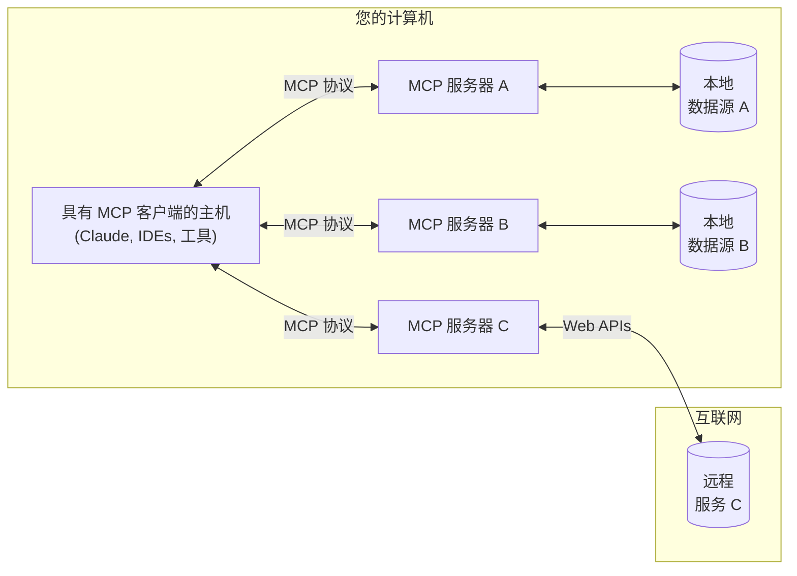

MCP 是一个开放协议，标准化了应用程序向 LLM 提供上下文的方式。可以将 MCP 想象成 AI 应用程序的 USB-C 接口。就像 USB-C 提供了一种标准化的方式将设备连接到各种外设和配件一样，MCP 提供了一种标准化的方式将 AI 模型连接到不同的数据源和工具。

## 为什么选择 MCP？

MCP 帮助您在 LLM 之上构建代理和复杂的工作流程。LLM 经常需要与数据和工具集成，而 MCP 提供：
- 您的 LLM 可以直接插入的预构建集成的不断增长的列表
- 在 LLM 提供商和供应商之间切换的灵活性
- 在您的基础设施内保护数据的最佳实践

### 一般架构

MCP 的核心是一个客户端-服务器架构，其中主机应用程序可以连接到多个服务器：

- **MCP 主机**: 像 Claude 桌面版、IDEs 或 AI 工具这样的程序，想要通过 MCP 访问数据
- **MCP 客户端**: 维护与服务器 1:1 连接的协议客户端
- **MCP 服务器**: 通过标准化的模型上下文协议暴露特定功能的轻量级程序
- **本地数据源**: MCP 服务器可以安全访问的计算机文件、数据库和服务
- **远程服务**: 通过互联网（例如，通过 APIs）可用的外部系统，MCP 服务器可以连接到这些系统

## 开始使用

选择最适合您需求的路径：

#### 快速入门
<CardGroup cols={2}>
  <Card
    title="对于服务器开发者"
    icon="bolt"
    href="/quickstart/server"
  >
    开始构建您自己的服务器，以便在 Claude 桌面版和其他客户端中使用
  </Card>
  <Card
    title="对于客户端开发者"
    icon="bolt"
    href="/quickstart/client"
  >
    开始构建您自己的客户端，可以与所有 MCP 服务器集成
  </Card>
  <Card
    title="对于 Claude 桌面版用户"
    icon="bolt"
    href="/quickstart/user"
  >
    开始在 Claude 桌面版中使用预构建的服务器
  </Card>
</CardGroup>

#### 示例
<CardGroup cols={2}>
  <Card
    title="示例服务器"
    icon="grid"
    href="/examples"
  >
    查看我们的官方 MCP 服务器和实现的画廊
  </Card>
  <Card
    title="示例客户端"
    icon="cubes"
    href="/clients"
  >
    查看支持 MCP 集成的客户端列表
  </Card>
</CardGroup>

## 教程

<CardGroup cols={2}>
  <Card
    title="使用 LLM 构建 MCP"
    icon="comments"
    href="/tutorials/building-mcp-with-llms"
  >
    学习如何使用像 Claude 这样的 LLM 加速您的 MCP 开发
  </Card>
  <Card
  title="调试指南"
  icon="bug"
  href="/docs/tools/debugging">
    学习如何有效调试 MCP 服务器和集成
  </Card>
  <Card
    title="MCP 检查器"
    icon="magnifying-glass"
    href="/docs/tools/inspector"
  >
    使用我们的交互式调试工具测试和检查您的 MCP 服务器
  </Card>
</CardGroup>

## 探索 MCP

深入了解 MCP 的核心概念和功能：

<CardGroup cols={2}>
  <Card
    title="核心架构"
    icon="sitemap"
    href="/docs/concepts/architecture"
  >
    了解 MCP 如何连接客户端、服务器和 LLM
  </Card>
  <Card
    title="资源"
    icon="database"
    href="/docs/concepts/resources"
  >
    将数据和内容从您的服务器暴露给 LLM
  </Card>
  <Card
    title="提示"
    icon="message"
    href="/docs/concepts/prompts"
  >
    创建可重用的提示模板和工作流程
  </Card>
  <Card
    title="工具"
    icon="wrench"
    href="/docs/concepts/tools"
  >
    使 LLM 能够通过您的服务器执行操作
  </Card>
  <Card
    title="采样"
    icon="robot"
    href="/docs/concepts/sampling"
  >
    让您的服务器请求 LLM 的完成
  </Card>
  <Card
    title="传输"
    icon="network-wired"
    href="/docs/concepts/transports"
  >
    了解 MCP 的通信机制
  </Card>
</CardGroup>

## 贡献

想要贡献？查看我们的[贡献指南](/development/contributing)，了解如何帮助改进 MCP。
